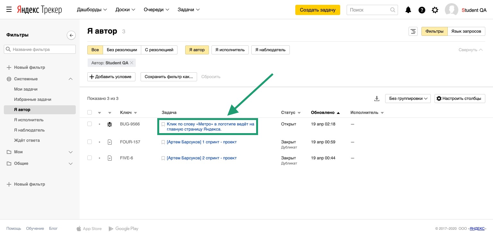

# Баг-репорты

В Трекере тебе предстоит не только создавать задачи, но и оформлять баг-репорты. Подробно с багами ты познакомился в Тренажёре в бесплатной части курса «Основы тестирования» в [теме №2 «Баг-репорт»](https://praktikum.yandex.ru/trainer/qa-engineer/lesson/09c014c6-2959-474e-9af9-44c85a3b5c03/).

## Как оформить баг-репорт в Трекере и привязать его к задаче.

### 1. Создание баг-репорта.

  
Подробная инструкция

  
  #### 1. Открой Трекер и нажми на кнопку «Создать задачу»:
  

  
Скриншот

  

#### 2. Кликни на поле «Выберите очередь» и в выпадающем списке выбери очередь «BUG: Баг-репорты»:

  
Скриншот

  

#### 3. Перед тобой страница создания баг-репорта. Нажми на кнопку «Выбрать поля» и убедись, что в выпадающем списке отмечены чек-боксы «Теги» и «Компоненты». Если не отмечены, то отметь их. Затем нажми на кнопку «Сохранить»:

  
Скриншот

  

#### 4. В поле «Задача» укажи заголовок баг-репорта опираясь на [подсказку в Тренажёре](https://praktikum.yandex.ru/trainer/qa-engineer/lesson/89324e6b-e7f6-4917-9ce7-79601bcf4a65/):

  
Скриншот

  

#### 5. В блоке «Описание» укажи описание бага, шаги для его воспроизведения, ожидаемый и фактический результат: о том, как правильно это сделать, ты можешь посмотреть [подсказку в Тренажёре](https://praktikum.yandex.ru/trainer/qa-engineer/lesson/09c014c6-2959-474e-9af9-44c85a3b5c03/). Также укажи в баг-репорте [используемое окружение](https://praktikum.yandex.ru/trainer/qa-engineer/lesson/b0cf6fd2-7d0f-4860-b941-babab3eaef82/):

  
Скриншот

  

#### 6. Загрузи скриншоты или скринкасты с подтверждением бага нажав на кнопку «Выберите файлы» или перетащив их с компьютера в область «Выберете файлы или перетащите сюда»:

  
Скриншот

  

#### 7. Раскрой выпадающий список «Приоритет» и выбери приоритет бага. Как правильно выбрать приоритет, ты можешь [узнать в Тренажёре](https://praktikum.yandex.ru/trainer/qa-engineer/lesson/9f10e497-6252-4f0a-ba33-c1b741aa83fe/):

  
Скриншот

  

#### 8. Нажми на кнопку «Создать»:

  
Скриншот

  

  

  
  
  ### 2. Как выглядит правильно созданный баг-репорт.
  

  
Подробнее

  
  Обрати внимание на поля в баг-репорте на панели справа. В новом (только что созданном) репорте они должны быть заполнены так:

- Тип - Ошибка
- Приоритет - *завсит от критичности бага
- Статус - Открыт
- Исполнитель - Не назначен
- Теги -  *пусто
- Компоненты -  *пусто

  
Скриншот

  

  

### 3. Как привязать баг-репорт к проектной задаче.

  
Подробная инструкция

  
  #### 1. В Трекере на верхней панели нажми на кнопку «Задачи» и в выпадающем списке выбери «Я автор»:
 
 
  
Скриншот

  

  
  #### 2. Откроется страница с твоими задачами и баг-репортами. Открой нужный репорт, нажав на его заголовок:

 
  
Скриншот

  

  
  #### 3. Скопируй ссылку на баг-репорт из адресной строки браузера и вставь в описание задачи, к которой нужно прикрепить репорт (если это доработка задачи, то ссылку на баг-репорт вставляй в комментарий к задаче). Прикреплённый к задаче репорт в ней будет отображаться так:

 
  
Скриншот

  

  

### 4. Как закрыть баг-репорт.

  
Подробнее

  
  Чтобы закрыть баг-репорт (например, если он создан ошибочно), нужно нажать на кнопку «Закрыть» под заголовком репорта, в выпадающем списке «Резолюция» выбрать «‎Не подтверждённый» и нажать на кнопку «Применить»:
  
 
  
Скриншот

  

  

