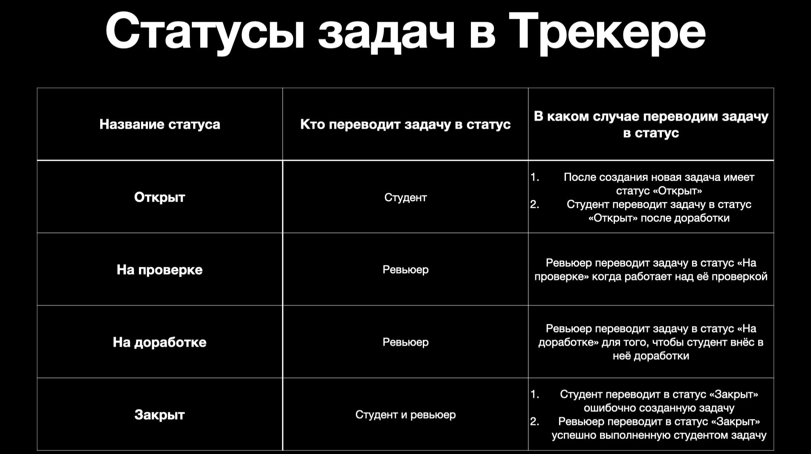
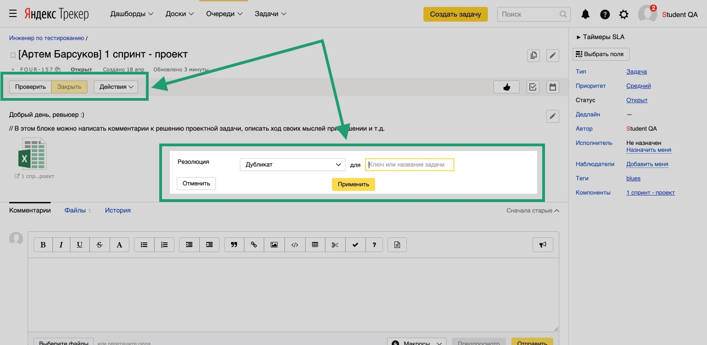
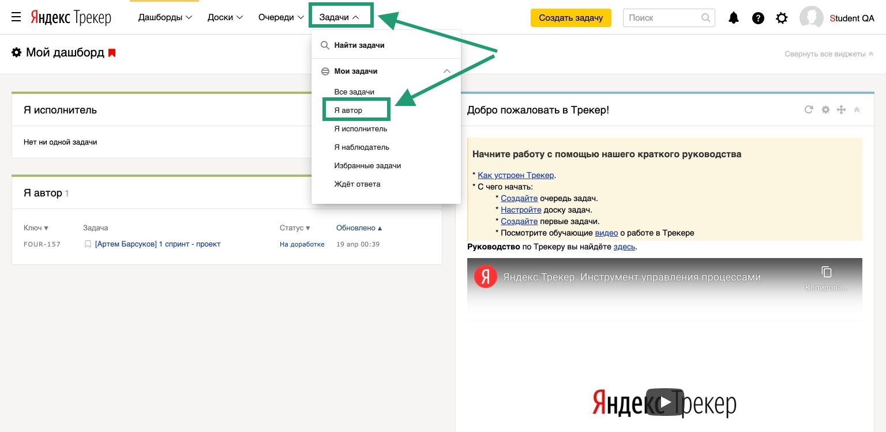
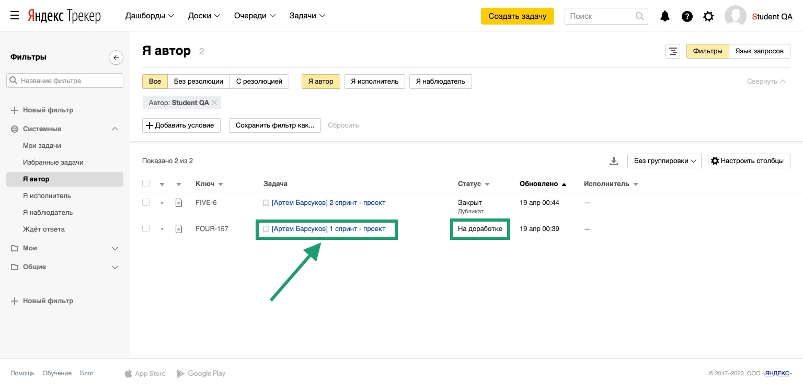
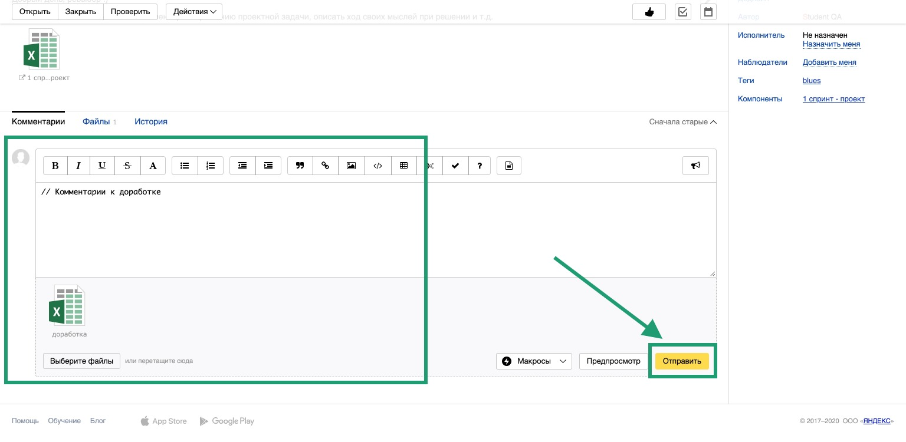
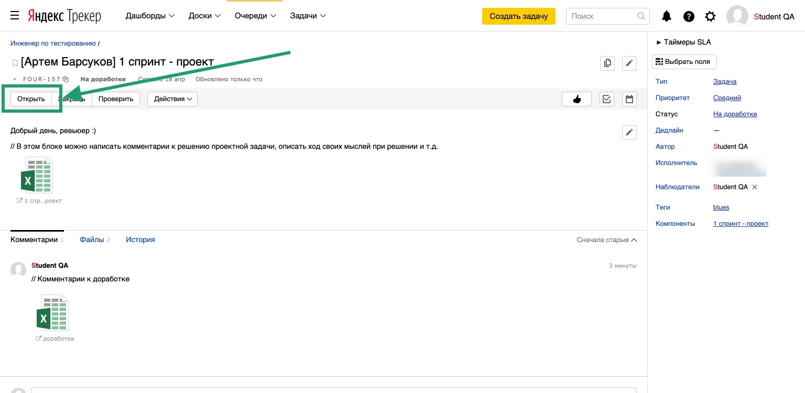

# Работа с задачами

В конце каждого спринта обучения тебе предстоит работа над проектом. Для отправки проеката на проверку нужно создать задачу [Яндекс.Трекере](https://tracker.yandex.ru/).

## Как создать задачу в Трекере, чтобы ревьюер увидел её и проверил?
  
### 1. Создание новой задачи.

  
Посмотреть

  
#### 1. Открой Трекер и нажми на кнопку «Создать задачу»:

  
Скриншот

  

#### 2. Кликни на поле «Выберите очередь» и в выпадающем списке выбери очередь «Инженер по тестированию» с номером твоего потока (номер потока написан на английском языке). Если в списке очередей нет нужной, то начни в поле для названия очереди вводить слово «Инженер» - очередь отобразится:

  
Скриншот

  

#### 3. Перед тобой страница создания задачи. Нажми на кнопку «‎Выбрать поля» и убедись, что в выпадающем списке отмечены чек-боксы «‎Теги» и «‎Компоненты». Если не отмечены, то отметь их. Затем нажми на кнопку «Сохранить»:

  
Скриншот

  

#### 4. В поле «Задача» напиши свои имя и фамилию и № спринта, к которому относится проект. Используй шаблон из примера:

  
Скриншот

  

#### 5. В блоке «Описание» можешь поприветствовать ревьюера, описать ход решения задачи, оставить комментарии для ревьюера и т.д.:

  
Скриншот

  

#### 6. Для загрузки в задачу файлов с решением и изображений нажми на кнопку «Выберите файлы». После этого выбери файлы на своём компьютере для загрузки. Альтернативный способ загрузки — перетащи файлы с компьютера в область «Выберете файлы или перетащите сюда»:

  
Скриншот

  

#### 7. Поле «Исполнитель» оставь пустым: когда ревьюер возьмёт твою задачу из общей очереди на проверку, он сам назначит себя исполнителем. Поля «Приоритет», «Связи», «Наблюдатели» и «Дедлайн» должны быть заполнены как на скриншоте:

  
Скриншот

  

#### 8. Раскрой выпадающий список «Теги» и выбери название своей группы:

  
Скриншот

  

#### 9. Раскрой выпадающий список «Компоненты» и выбери спринт, к которому относится проект:

  
Скриншот

  

#### 10. Нажми на кнопку «Создать»:

  
Скриншот

  

  

____

### 2. Как выглядит правильно созданная задача.

  
Посмотреть

  
Обрати внимание на поля в задаче на панели справа. В новой (только что созданной) задаче они должны быть заполнены так:

- Тип — Задача
- Приоритет — Средний
- Статус — Открыт
- Исполнитель — Не назначен
- Теги — *название твоей группы
- Компоненты — *№ спринта, к которому относится проект

  
Скриншот

  

  

____

### 3. Статусы задач.

  
Посмотреть

  
  У каждой задачи в Трекере есть статус. Ниже представлена таблица с описанием каждого статуса и тем, как работать со своей задачей после проверки её ревьюером:
  

  
Скриншот

  

- Чтобы перевести задачу в нужный статус, нажми на кнопку с его названием.
- При переводе в статус «Закрыт» нужно указать резолюцию (причину закрытия задачи): выбери резолюцию «Дубликат». Затем нажми кнопку «Применить».

Кнопки с названием статуса расположены под заголовком задачи:

  
Скриншот

  

  

  
  ____
  
### 4. Доработка задачи.

 
Посмотреть

Когда ревьюер проверит твою работу, он закроет твою задачу (в случае, если решение верное) или переведёт её в статус «На доработке».

В Трекере тебе предстоит контролировать свои задачи. В задачах со статусом «На доработке» в блоке «Комментарии» ты увидишь обратную связь от ревьюера с комментариями о том, какие моменты в решении задачи необходимо исправить.

#### 1. В Трекере на верхней панели нажми на кнопку «Задачи» и в выпадающем списке выбери «Я автор»:

  
Скриншот

  

  
  #### 2. Откроется страница с твоими задачами. Дорабатывать проект требуется в задачах, имеющих статус «На доработке». Открой задачу в этом статусе, нажав на её заголовок:

  
Скриншот

  

  
 #### 3. Внеси комментарии к доработке в поле задачи «Комментарии», загрузи файлы с решением, нажав на кнопку «Выберите файлы» или перетащив их с компьютера в область «Выберете файлы или перетащите сюда». После этого нажми на кнопку «Отправить»:
 

  
Скриншот

  

  
  #### 4. Обязательно переведи задачу в статус «Открыт», нажав на кнопку «Открыть» под заголовком задачи:
  

  
Скриншот

  

  

