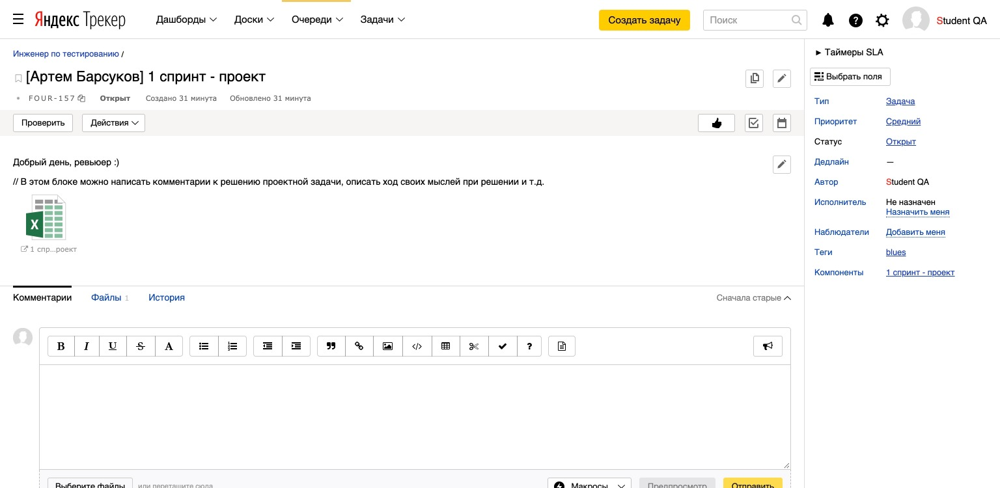

# Работа с задачами

В конце каждого спринта обучения тебе предстоит работа над проектом. Для отправки проеката на проверку нужно создать задачу [Яндекс.Трекере](https://tracker.yandex.ru/).

## Как создать задачу в Трекере, чтобы ревьюер увидел её и проверил?
  
### 1. Создание новой задачи.

  
Подробная инструкция

  
#### 1.1 Открой Трекер и нажми на кнопку «Создать задачу»:

  
Скриншот

  

#### 1.2 Кликни на поле «Выберите очередь» и в выпадающем списке выбери очередь «‎Инженер по тестированию» с номером твоего потока (номер потока написан на английском языке):

  
Скриншот

  

#### 1.3 Перед тобой страница создания задачи. Нажми на кнопку «‎Выбрать поля» и убедись, что в выпадающем списке отмечены чек-боксы «‎Теги» и «‎Компоненты». Если не отмечены, то отметь их. Затем нажми на кнопку «Сохранить»:

  
Скриншот

  

#### 1.4 В поле «Задача» напиши свои имя и фамилию и № спринта, к которому относится проект. Используй шаблон из примера:

  
Скриншот

  

#### 1.5 В блоке «Описание» можешь поприветствовать ревьюера, описать ход решения задачи, оставить комментарии для ревьюера и т.д.:

  
Скриншот

  

#### 1.6 Для загрузки в задачу файлов с решением и изображений нажми на кнопку «Выберите файлы». После этого выбери файлы на своём компьютере для загрузки. Альтернативный способ загрузки — перетащи файлы с компьютера в область «Выберете файлы или перетащите сюда»:

  
Скриншот

  

#### 1.7 Поле «Исполнитель» оставь пустым: когда ревьюер возьмёт твою задачу из общей очереди на проверку, он сам назначит себя исполнителем. Поля «Приоритет», «Связи», «Наблюдатели» и «Дедлайн» должны быть заполнены как на скриншоте:

  
Скриншот

  

#### 1.8 Раскрой выпадающий список «Теги» и выбери название своей группы:

  
Скриншот

  

#### 1.9 Раскрой выпадающий список «Компоненты» и выбери спринт, к которому относится проект:

  
Скриншот

  

#### 1.10 Нажми на кнопку «Создать»:

  
Скриншот

  

  

### 2. Как выглядит правильно созданная задача.

  
Подробнее

  
Обрати внимание на поля в задаче на панели справа. В новой (только что созданной) задаче они должны быть заполнены так:

- Тип — Задача
- Приоритет — Средний
- Статус — Открыт
- Исполнитель — Не назначен
- Теги — *название твоей группы
- Компоненты — *№ спринта, к которому относится проект

  
Скриншот

  

  

