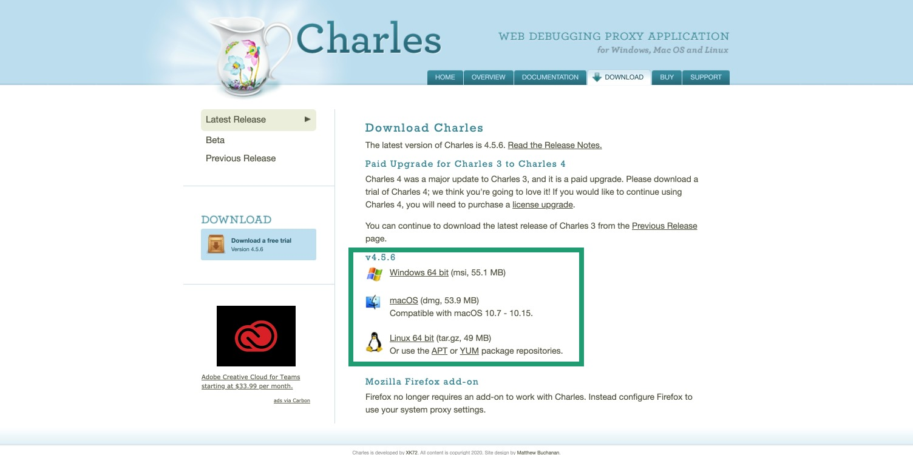

# Charles: установка и настройка.

### 1. Скачивание и первоначальная настройка.

  
Подробная инструкция

  
#### 1. Чтобы скачать Charles, перейди по ссылке https://www.charlesproxy.com/download/

#### 2. На открывшейся странице нажми на название своей операционной системы. Начнётся загрузка программы:

  
Скриншот

  

#### 3. После установки и первого запуска Charles нужно установить сертификат безопасности. Для этого открой в программе меню «Help» → «SSL Proxying» → «Install Charles Root Certificates»:

  
Скриншот

  

#### 4. 4. Установи сертификат:

   - Windows: В появившемся окне нажми «Установить сертификат». В следующем — «Текущий пользователь». Затем на этапе выбора хранилища сертификатов выбери второй пункт «Поместить все сертификаты в следующее хранилище» и нажми «Обзор...». Выбери папку «Доверенные корневые центры сертификации» и жми в остальных пунктах кнопку «Далее».
После установки сертификата Windows покажет предупреждение системы безопасности. Нажми «Yes» или «Да» в  окне. Так ты добавишь сертификат в хранилище доверенных корневых сертификатов:

  
Скриншот

  

- MacOS: Установи сертификат. Затем в пункте меню «Связка ключей» найди добавленный сертификат и в разделе «Доверие» разреши ему выполнять все действия. По умолчанию выставлены стандартные настройки; нужно заменить на «Всегда доверять».

#### 5. Перезапусти Charles. Затем перейди в меню «Proxy» → «SSL Proxying Settings»:

  
Скриншот

  

#### 6. В открывшемся окне во вкладке «SSL Proxying» нажми кнопку «Add» под блоком «Include» и добавь символ * в каждую строку («Host» и «Port»), затем нажми OK. Также поставь чек-бокс «Enable SSL Proxying» и нажми OK:

  
Скриншот

  

#### 7. Убедись, что в меню «Proxy» стоит галочка напротив «Windows Proxy» или «macOS Proxy» (в зависимости от операционной системы). Если не стоит, то кликни на эту строку:

  
Скриншот

  

  

