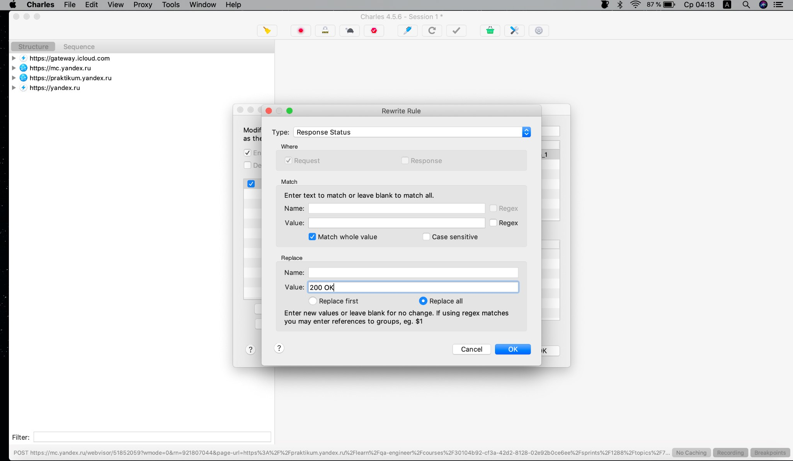
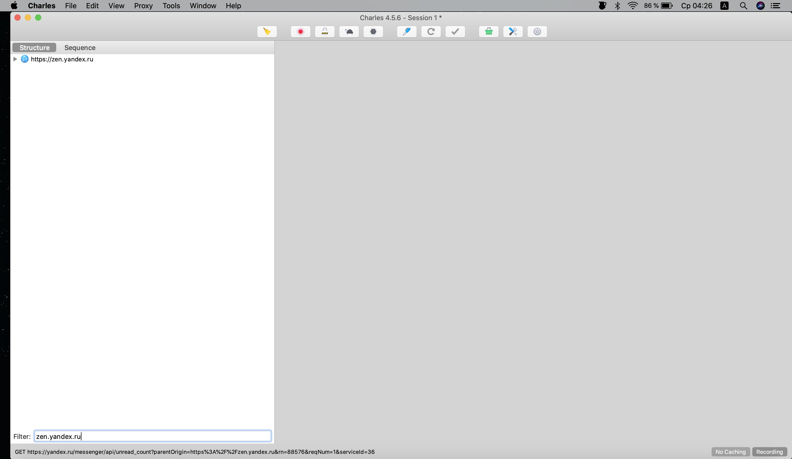
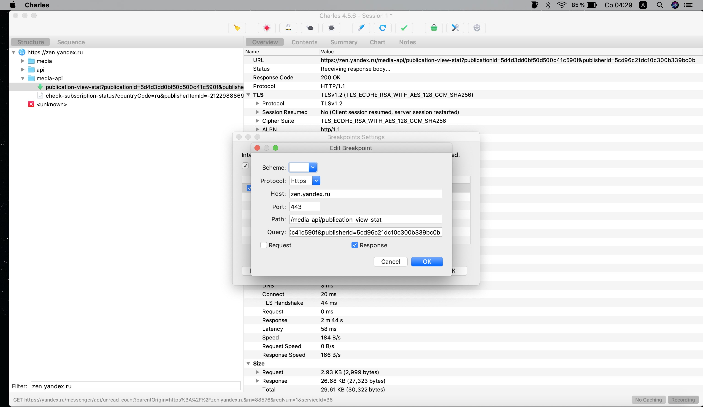

# Charles: установка и настройка.

### 1. Скачивание и первоначальная настройка.

  
Посмотреть

  
#### 1. Чтобы скачать Charles, перейди по ссылке https://www.charlesproxy.com/download/

#### 2. На открывшейся странице нажми на название своей операционной системы. Начнётся загрузка программы:

  
Скриншот

  

#### 3. После установки и первого запуска Charles нужно установить сертификат безопасности. Для этого открой в программе меню «Help» → «SSL Proxying» → «Install Charles Root Certificates»:

  
Скриншот

  

#### 4. 4. Установи сертификат:

   - Windows: В появившемся окне нажми «Установить сертификат». В следующем — «Текущий пользователь». Затем на этапе выбора хранилища сертификатов выбери второй пункт «Поместить все сертификаты в следующее хранилище» и нажми «Обзор...». Выбери папку «Доверенные корневые центры сертификации» и жми в остальных пунктах кнопку «Далее».
После установки сертификата Windows покажет предупреждение системы безопасности. Нажми «Yes» или «Да» в  окне. Так ты добавишь сертификат в хранилище доверенных корневых сертификатов:

  
Скриншот

  

- MacOS: Установи сертификат. Затем в пункте меню «Связка ключей» найди добавленный сертификат и в разделе «Доверие» разреши ему выполнять все действия. По умолчанию выставлены стандартные настройки; нужно заменить на «Всегда доверять».

#### 5. Перезапусти Charles. Затем перейди в меню «Proxy» → «SSL Proxying Settings»:

  
Скриншот

  

#### 6. В открывшемся окне во вкладке «SSL Proxying» нажми кнопку «Add» под блоком «Include» и добавь символ * в каждую строку («Host» и «Port»), затем нажми OK. Также поставь чек-бокс «Enable SSL Proxying» и нажми OK:

  
Скриншот

  

#### 7. Убедись, что в меню «Proxy» стоит галочка напротив «Windows Proxy» или «macOS Proxy» (в зависимости от операционной системы). Если не стоит, то кликни на эту строку:

  
Скриншот

  

  

### 2. Автоматическое изменение ответа сервера.

  
Посмотреть

  
  #### 1. Чтобы изменять ответ сервера в автоматическом режиме, в Charles открой меню «Tools» → «Rewrite»:
  

  
Скриншот

  

  
  #### 2. Поставь чек-бокс «Enable Rewrite» и нажми на кнопку «Add»:
  

  
Скриншот

  

  
  #### 3. В открывшемся окне заполни поле «Name» и нажми «Add» в блоке «Location». Заполни появившиеся поля согласно заданию из Тренажёра и нажми OK:
  

  
Скриншот

  

  
  Должен появиться результат как на скриншоте:
  

  
Скриншот

  

  
  #### 4. Нажми «Add» в блоке «Type/Action». Заполни появившиеся поля согласно заданию из Тренажёра и нажми OK:
  

  
Скриншот

  

  
  #### 5. Убедись, что настройки автоматической подмены совпадают с тем, что изображено на скриншоте и нажми ОК:
  

  
Скриншот

  

  
  #### 6. Убедись, что в меню «Tools» стоит галочка напротив «Rewrite». Если не стоит, то кликни на эту строку:
  

  
Скриншот

  

  

### 3. Ручное изменение ответа сервера.

  
Посмотреть

  
  #### 1. Чтобы изменять ответ сервера вручную, в Charles настрой фильтр по целевому сайту. Затем открой нужную страницу в браузере. Например, для страницы https://zen.yandex.ru/media/praktikum/skolko-nujno-programmistov-chtoby-vy-chitali-dzen-5d4d3dd0bf50d500c41c590f укажи в фильтре zen.yandex.ru:
  

  
Скриншот

  

  
  #### 2. В Charles в структуре запросов слева раскрой структуру сайта, затем раскрой каталог media-api и кликни правой кнопкой мыши на целевого URL. В появившемся меню отметь галочкой «Breakpoints»:
  

  
Скриншот

  

  
  #### 3. В Charles открой меню «Proxy» → «Breakpoint Settings»:
  

  
Скриншот

  

  
  #### 4. Убедись, что в открывшемся окне установлен чек-бокс «Enable Breakpoints» и чек-бокс для целевого URL:
  

  
Скриншот

  

  
  #### 5. Сделай двойной клик по строке с URL. Убери чек-бокс «Request» и оставь чек-бокс «Response»: чтобы не «ловить» запросы, а только ответы сервера. Нажми OK:
  

  
Скриншот

  

  
  #### 6. В результате предыдущих действий окно с настройками должно выглядеть как на скриншоте. Нажми OK:
  

  
Скриншот

  

  
  #### 7. Теперь нужно подменить ответ сервера. В браузере обнови страницу, от которой «ловишь» ответ и вернись в Charles: открылось окно редактирования запроса. В верхней части окна кликни по надписи «Edit Response». Затем в нижней части окна открой вкладку «JSON Text», отредактируй нужный параметр и нажми кнопку «Execute». После обновления страницы в браузере ты увидишь новое значения отредактированного параметра. Нужно успеть отредактировать ответ за 20 секунд, иначе приложение решит, что ответ от сервера не пришёл. Тогда придётся обновить страницу в браузере и повторить редактирование ответа:
  

  
Скриншот

  

  

